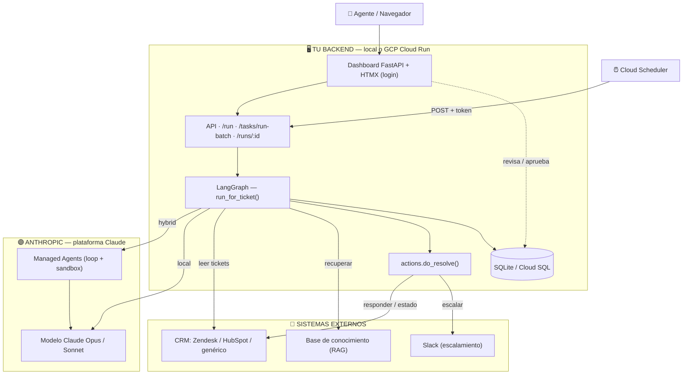
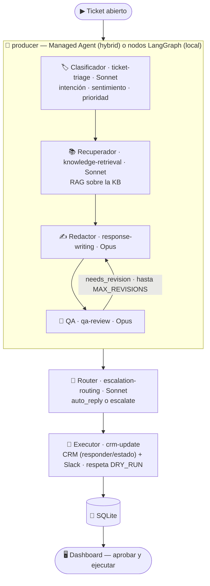

# 🎧 contact-center-agents

**Equipo multiagente de soporte (Contact Center) con LangGraph + Claude.**

Procesa tickets abiertos de tu CRM: **clasifica → recupera conocimiento (RAG) →
redacta la respuesta → control de calidad → decide auto-responder o escalar →
actualiza el CRM**. Con **dashboard de revisión/aprobación** (human-in-the-loop),
**runtime híbrido** (agentes en la plataforma de Claude) y listo para **GCP**.

> Construido con el mismo patrón que [`realestate-editorial-agents`](https://github.com/sredondomercuria/realestate-editorial-agents),
> reutilizando el skill-pack constructor. Cambian los **roles**, los **conectores** y los
> **criterios de calidad**; la arquitectura es la misma.

## ✨ Qué incluye
- **Equipo de agentes** con LangGraph y bucle de **QA** (redactor ⇄ crítico).
- **Runtime híbrido**: la resolución corre como **Managed Agent** en la plataforma de
  Claude, con *fallback* local. (`AGENT_RUNTIME`)
- **CRM real y pluggable**: **Zendesk**, **HubSpot** y un cliente **REST genérico**
  (interfaz común `get_crm()`).
- **Omnicanal vía ManyChat**: WhatsApp, Instagram, Facebook Messenger, TikTok y Telegram
  — webhook de entrada (`/webhooks/manychat`) + respuesta por la Send API. Ver [docs/09](docs/09-manychat.md).
- **RAG** sobre una base de conocimiento (`knowledge_base/`).
- **Dashboard FastAPI + HTMX** con **login**: cola de respuestas para revisar y aprobar.
- **Escalamiento** a humano vía Slack. **Persistencia** SQLite.
- **GCP**: Dockerfile (Cloud Run), Secret Manager, Cloud Scheduler. **DRY_RUN** seguro.

## 🗺️ Arquitectura del sistema



## 🧠 El equipo de agentes



## 🚀 Quickstart (local)

```bash
# Requiere Python 3.10+. ¿No tenés? uv: uv venv + `uv pip install`.
python3 -m venv .venv && source .venv/bin/activate
pip install -e ".[dev,integrations]"

cp .env.example .env       # poné ANTHROPIC_API_KEY (+ CRM real o probá con la KB)
make web                   # dashboard en http://localhost:8080
# o por CLI:  make dry-run (procesa tickets abiertos sin ejecutar nada)
```

## 🔌 CRM (real y pluggable)

`CRM_PROVIDER` selecciona el cliente (interfaz común `get_crm()`):

| Provider | Config | Notas |
|---|---|---|
| `zendesk` | `ZENDESK_SUBDOMAIN/EMAIL/API_TOKEN` | comentarios públicos/privados, status |
| `hubspot` | `HUBSPOT_TOKEN` | respuesta como Nota asociada al ticket; `hs_pipeline_stage` |
| `generic` | `CRM_GENERIC_BASE_URL/TOKEN` | cualquier REST de tickets; ajustá rutas en `integrations/crm/generic.py` |

Todas normalizan a `{id, subject, body, requester, status, priority, url}`. Para enchufar
otro CRM, agregá una clase con la misma interfaz. Ver [docs/05-integraciones-crm.md](docs/05-integraciones-crm.md).

## ☁️ Deploy a GCP

```bash
gcloud auth login
export GCP_PROJECT=... REGION=southamerica-east1
bash deploy/push-secrets.sh .env
bash deploy/deploy.sh
export SCHEDULER_TOKEN=...; bash deploy/scheduler.sh   # procesa tickets cada 15 min
```

## 📚 Tutorial
[01 Arquitectura](docs/01-arquitectura.md) · [02 Instalación](docs/02-instalacion.md) ·
[03 Skills](docs/03-skills.md) · [04 Agentes](docs/04-agentes-langgraph.md) ·
[05 CRM](docs/05-integraciones-crm.md) · [06 Scheduling & GCP](docs/06-scheduling-gcp.md) ·
[07 Cowork](docs/07-cowork.md) · [08 Mejores prácticas](docs/08-mejores-practicas.md) ·
[09 ManyChat (omnicanal)](docs/09-manychat.md)

## 🔐 Seguridad
- Secretos en `.env` (local) / **Secret Manager** (GCP). En el repo, sólo `.env.example`.
- **`DRY_RUN=true`** por defecto: genera respuestas pero **no toca el CRM** hasta aprobar.
- Dashboard con **login por sesión** (`AUTH_PASSWORD`/`SESSION_SECRET`).
- Casos sensibles (legal/fraude/datos) → el sistema **escala a humano**, no auto-responde.

## 📄 Licencia
[MIT](LICENSE). Proyecto educativo; revisá las respuestas antes de enviarlas a clientes.
