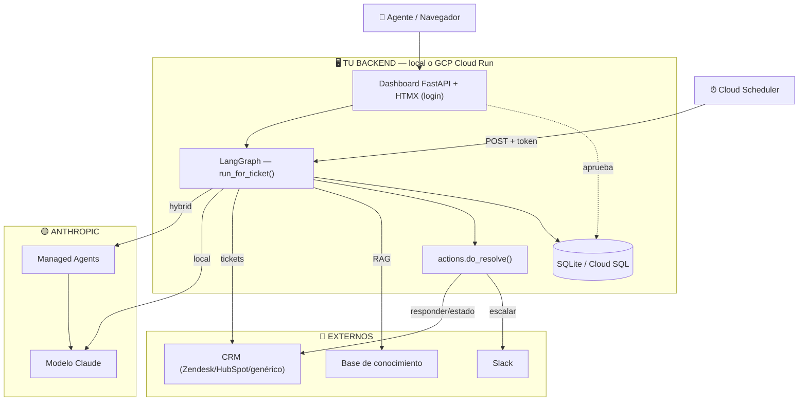
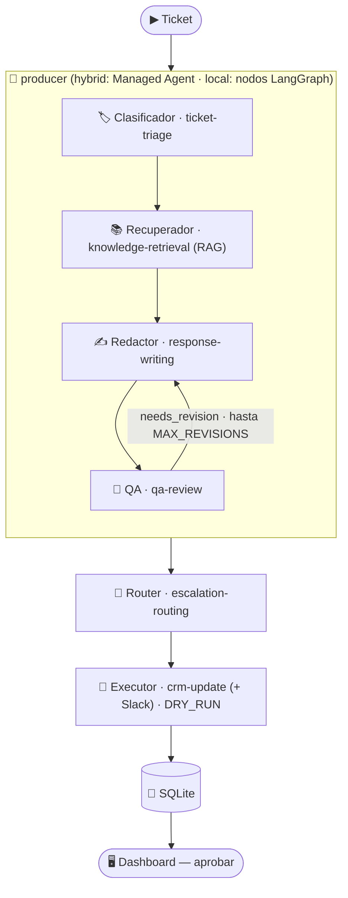

# 01 · Arquitectura

Equipo multiagente de **soporte**: por cada ticket abierto, clasifica → recupera
conocimiento → redacta → controla calidad → decide auto-responder o escalar → actualiza
el CRM. Con dashboard para que un humano revise y apruebe.

## El modelo mental en 30 segundos

Dos ejes independientes:
- **¿Dónde corre TU código?** local o **GCP Cloud Run** (backend, UI, scheduler, DB).
- **¿Quién corre el LOOP de agentes?** LangGraph (`AGENT_RUNTIME=local`) o **Managed
  Agents** de Anthropic (`AGENT_RUNTIME=hybrid`, default, con fallback a local).

El **modelo Claude** siempre está en Anthropic. Lo único específico del dominio son los
**conectores** (CRM, KB, Slack) y los **criterios de calidad**.

## Stack

| Pieza | Elección |
|-------|----------|
| Orquestación | LangGraph (+ Managed Agents en híbrido) |
| Modelo | Claude `claude-opus-4-8` / `claude-sonnet-4-6` |
| Conocimiento | RAG sobre `knowledge_base/` (keywords; upgradeable a embeddings) |
| CRM / ticketing | **Zendesk · HubSpot · genérico REST** (interfaz común) |
| Escalamiento | Slack (webhook) |
| UI + Backend | FastAPI + HTMX, con login |
| Persistencia | SQLite (local) / Cloud SQL (GCP) |
| Despliegue | GCP Cloud Run + Secret Manager + Cloud Scheduler |

## Diagrama del sistema

## Diagrama de agentes

## El estado compartido
`ticket → triage → knowledge → draft ⇄ review → routing → result`. Ver `state.py`.

## El bucle de calidad
El crítico (QA) revisa exactitud, política, tono, completitud, seguridad e idioma; si hay
problemas, **devuelve al redactor** (hasta `MAX_REVISIONS`). Casos sensibles → escalar.

## Siguiente
→ [02-instalacion.md](02-instalacion.md)
