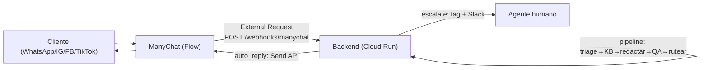

# 09 · Canales omnicanal con ManyChat (WhatsApp, Instagram, Facebook, TikTok)

ManyChat es la **capa de canales**: conecta WhatsApp, Instagram DM, Facebook Messenger,
TikTok y Telegram. El sistema **recibe** los mensajes vía un webhook y **responde** por la
API de ManyChat — sin integrar cada canal por separado.

## Cómo fluye (end to end)



1. El cliente escribe por cualquier canal conectado en ManyChat.
2. Un **Flow** de ManyChat con un paso **External Request** llama a nuestro webhook
   `POST /webhooks/manychat` con el mensaje + el `subscriber_id`.
3. El backend corre el pipeline (clasifica, recupera KB, redacta, QA, rutea).
4. **Respuesta**: si `auto_reply`, se envía por la **Send API** de ManyChat
   (`/fb/sending/sendContent`) al mismo subscriber → llega por su canal. Si `escalate`,
   se le avisa, se marca con un **tag** de handoff y se notifica al equipo (Slack).
5. `DRY_RUN=true` → no se envía nada; queda en el dashboard para aprobación humana.

## Configurar ManyChat (una vez)

1. **Conectá los canales** en ManyChat: WhatsApp (requiere WABA/Meta verificado),
   Instagram y Facebook (páginas conectadas), TikTok, Telegram.
2. **API key**: ManyChat → Settings → API → copiala a `MANYCHAT_API_KEY`.
3. Creá un **Flow** que se dispare con cualquier mensaje entrante (Default Reply / Keyword)
   y agregá un paso **External Request**:
   - **Method**: POST · **URL**: `https://<tu-servicio>.run.app/webhooks/manychat`
   - **Headers**: `X-Webhook-Token: <MANYCHAT_WEBHOOK_TOKEN>` · `Content-Type: application/json`
   - **Body** (JSON):
     ```json
     {
       "subscriber_id": "{{contact_id}}",
       "channel": "whatsapp",
       "message": "{{last_input_text}}",
       "name": "{{first_name}} {{last_name}}"
     }
     ```
   - (Opcional) Antes del External Request, un mensaje de espera: "Estamos viendo tu consulta…".
4. Definí el `MANYCHAT_API_KEY`, `MANYCHAT_WEBHOOK_TOKEN` y (si usás handoff) un **tag**
   `handoff-humano` en ManyChat.

## ✅ Checklist end-to-end (qué hace falta para que funcione completo)

| # | Requisito | Estado |
|---|-----------|--------|
| 1 | `ANTHROPIC_API_KEY` (con acceso a Managed Agents para `hybrid`, o cae a `local`) | tuyo |
| 2 | **Cuenta ManyChat** + plan que habilite **API** (la API es de planes pagos/Pro) | **tuyo** |
| 3 | Canales conectados en ManyChat (WhatsApp WABA, IG/FB pages, TikTok…) | **tuyo** |
| 4 | `MANYCHAT_API_KEY` + `MANYCHAT_WEBHOOK_TOKEN` en `.env` / Secret Manager | **tuyo** |
| 5 | **Webhook público**: deployar a Cloud Run (ManyChat necesita una URL HTTPS) | `deploy/` |
| 6 | **Flow** con External Request apuntando a `/webhooks/manychat` (body de arriba) | **tuyo** (en ManyChat) |
| 7 | Base de conocimiento poblada (`knowledge_base/`) para respuestas con datos reales | incluido (ejemplos) |
| 8 | (Opcional) CRM para tickets por email; (opcional) Slack para escalamiento | opcional |
| 9 | `DRY_RUN=false` cuando quieras que responda solo (con escalamiento de casos sensibles) | config |

Lo que **ya está hecho** (código): conector ManyChat (`integrations/manychat.py`), webhook
(`/webhooks/manychat`), enrutado de la salida por canal (`actions.py`), pipeline, dashboard,
deploy. Lo que **depende de vos**: la cuenta de ManyChat con API, conectar los canales, y
configurar el Flow apuntando al webhook deployado.

## WhatsApp: ventana de 24 h
Como respondemos a un mensaje entrante, estás dentro de la ventana de servicio y
`sendContent` (texto libre) funciona. Para mensajes *iniciados por el negocio* fuera de las
24 h, hay que usar una **plantilla** aprobada vía `send_flow(subscriber_id, flow_ns)`.

## Probar
- **Local (sin canales)**: simulá el webhook con `curl` (ver abajo). El pipeline corre de
  verdad; con `DRY_RUN=true` deja el borrador en el dashboard.
  ```bash
  curl -X POST localhost:8080/webhooks/manychat -H "Content-Type: application/json" \
    -d '{"subscriber_id":"demo-1","channel":"whatsapp","message":"No me llega el reembolso de mi devolución","name":"Ana"}'
  ```
- **Live**: deployá, configurá el Flow, y escribí por WhatsApp/IG al número/cuenta conectados.

## Siguiente
→ [06-scheduling-gcp.md](06-scheduling-gcp.md) para deployar el webhook.
